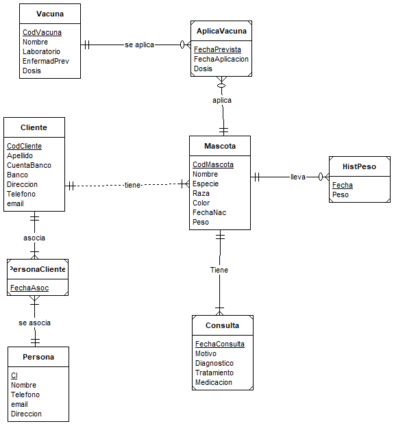

= Proyecto Final para Base de Datos: Grupo 2 -- Veterinaria
Jassiel Ovando Franco <a2021117600@estudiantes.upsa.edu.bo>
:toc: auto
:toc-title: Conteniod
:doctype: book
:source-highlighter: highlightjs

Para el proyecto final se contempla la elaboración del mismo como una ampliación de los modelos que se vieron durante la materia (nuevas entidades, relaciones o su modificación).

== Etapas Calificadas

.Etapas calificadas:
. (15 %) Modelo lógico completo.
. (15 %) *Implementación:* Creación de las tablas de bases de datos, o su modificación (_SQL-DDL_), _se puede incluir inserción de datos (SQL-DML) y posibles consultas (SQL-DQL)_.
. (30 %) *Actividades del negocio:* Procedimientos almacenados para realizarlas (descritas en el problema), aplicando conceptos de transacción, y contemplando los parámetros necesarios en los procedimientos, _incluyendo un parámetro de salida que indique el resultado de la operación (RETURNS)_.
. (15 %) *Reportes:* Procedimientos almacenados (_SQL_) para generar los datos en forma de reporte.
. (25 %) *Programa:* Capa de negocio que realice la invocación de los procedimientos almacenados, y presente los resultados. _Es posible invocar los procedimientos de creación o alteración de las tablas en la base de datos, además de crear un menú simple para distintas operaciones_.

== Estructura del Documento

. *Introducción:* Descripción e introducción del proyecto.
. *Modelo conceptual:* Diagrama ERD base, con las entidades y relaciones del problema. _Declaración de las entidades y relaciones_.
. *Modelo lógico:* Diagrama ERD detallado, conceptual más atributos. _Definición de la estructura de la base de datos_.
. *Consideraciones y decisiones de implementación:* Descripciones de decisiones y adiciones de implementación.
. *Modelo físico:* Diagrama ERD final-avanzado, lógico más índices, claves foráneas, etc. _Modelo físico de la implementación de la base de datos_.
. *Arquitectura de la solución construida:* Descripción de la arquitectura empleada: dos capas/tres capas/api...
.. Herramientas
.. Lenguaje
.. Sistema de Gestión de Base de Datos
.. Plataforma
.. Etc.
. *Implementación:* Código SQL de la base de datos.
.. *DDL:* Creación de la base de datos, tablas, índices, etc.
.. *DML:* Manipulación de datos de la base de datos.
.. *DQL:* Consulta de datos de la base de datos.

= Documento

== Enunciado

Un veterinario tiene como pacientes: animales, y como clientes: familias.
Un cliente es un conjunto de personas que suelen corresponderse con una familia.

Cada cliente tiene: código, apellido paterno (cabeza de la familia), número de cuenta bancaria, dirección, teléfono, y nombres e identificación de personas correspondientes.
No existe el límite de personas asociadas a un cliente, además, una persona puede estar dado de alta en varios clientes.

_Ejemplo: Un hombre que vive con su esposa tiene un gato y como tal pertenece a un cliente, pero también está dado de alto en el cliente asociado con el perro de sus padres._

Los clientes pueden tener varias mascotas, cada mascota tiene: código, alias, especia, raza, color de pelo, fecha de nacimiento, peso (mantener un historial sobre el peso de la mascota por las últimas 10 visitas, además del peso actual).
Así mismo se guarda un historial médico con cada enfermedad que tuvo y la fecha en la que se enfermó.
Adicionalmente, cada mascota tiene un calendario de vacunación, en la que se llena el registro de: cada vacuna, y la enfermedad contra la que se está vacunando.

=== Ampliación: Servicio de Hotel de Mascotas

La veterinaria está desarrollando un nuevo negocio de _hotel de mascotas_, para o cual necesitan ampliar su sistema teniendo en cuenta el funcionamiento deseado de este nuevo servicio:

* Se puede hospedar a cualquier mascota sea o no paciente de la veterinaria, pero debe registrarse la información para todos.
* Para el huésped, debe registrarse si tiene necesidades especiales en cuanto a medicación, alimentación o algún cuidado particular.
* La alimentación en general se cobra como parte del servicio de hospedaje, excepto cuando requiere alimentación especial, que se factura de manera adicional, lo mismo que medicinas y otros insumos que sean necesarios para su cuidado particular.

==== Requerimientos

* El servicio incluye también la higiene básica de un baño al ser recibido, y en estancias prolongadas un baño semanal adicional, cualquier servicio más allá de eso se considera extra en la cuenta.
* Se debe construir la funcionalidad necesaria para el registro de los huéspedes y todas sus necesidades.
Además de construir la funcionalidad para la verificación (check out) del huésped y la emisión de la nota de cobranza.
* Se debe elaborar un reporte de los huéspedes atendidos en un periodo de entre 2 fechas, incluyendo los huéspedes que están siendo atendidos.
* Por último, elaborar todas las interfaces ABMC/CRUD necesarias para el manejo de los datos.

Entonces:

.Se tienen 2 funciones:
. Registro de huéspedes
. Reporte de huéspedes en periodo de fechas

===== Registro de huésped
Para esta función se debe poder registrar a un huésped, por lo tanto depende de poder registrar a una mascota, cliente, encargado y persona.
Luego, se puede registrar al huésped como una estadía, que a su vez, depende de poder registrar las habitaciones, servicios y requerimientos.
Lo que no viene a considerarse son los historiales.

.Cobranzas
[source,python]
----
include::scripts/cobranza.py[]
----

===== Reporte de huéspedes en periodo de fechas
Para el reporte debe haber una entrada con dos parámetros, fecha de inicio y fecha de final, la salida debe ser la lista de todos los huéspedes que tengan su fecha de inicio mayor o igual a la fecha de inicio de entrada, y su fecha de salida mayor a la fecha de registro de entrada.
Caso contrario, no se lo toma en cuenta.

.Por ejemplo:
Tenemos 3 estadías:

* Estadía 1: Fecha de inicio 1/1/2021, Fecha de salida 10/1/2021
* Estadía 2: Fecha de inicio 5/1/2021, Fecha de salida 15/1/2021
* Estadía 3: Fecha de inicio 20/1/2021, Fecha de salida 30/1/2021
* Estadía 4: Fecha de inicio 25/12/2020, Fecha de salida 5/1/2020
* Estadía 5: Fecha de inicio 20/12/2020, Fecha de salida 30/12/2020

Luego la entrada de fechas, 1/1/2021 y 10/1/2021.
La salida debería ser

* Estadía 1: Fecha de inicio 1/1/2021, Fecha de salida 10/1/2021
* Estadía 2: Fecha de inicio 5/1/2021, Fecha de salida 15/1/2021
* Estadía 4: Fecha de inicio 25/12/2020, Fecha de salida 5/1/2020

Todas las demás no se consideran porque no entran dentro del rango:

.Reporte de huéspedes en periodo de fechas
[source,python]
----
include::scripts/reporte-por-periodo.py[]
----

Tal cual se ve, se aprecia como se considera a un huésped, luego para el reporte se debe considerar a todos los huéspedes que cumplan con la condición.
Además de agregar un mensaje extra que mencione si el huésped está actualmente en el hotel o no.

== Modelos

=== Base (por profesor)

=== Modelo Conceptual

[plantuml]
----
include::docs/assets/erd/conceptual.pu[]
----

=== Modelo Lógico

[plantuml]
----
include::docs/assets/erd/logical.pu[]
----

=== Modelo Físico

==== PlantUML

[plantuml]
----
include::docs/assets/erd/physical.pu[]
----

==== DBeaver

// image::modelos/3-fisico.[alt]